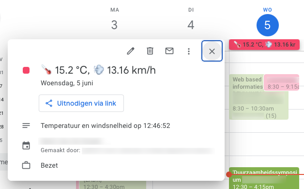
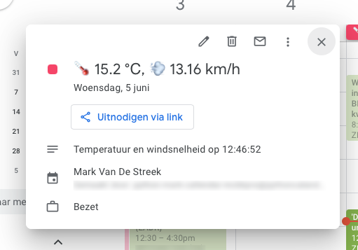

# HomeAssistant Google Calendar Pimp

This repo contains a little python side-project to pimp your Google Calendar. 
The goal is to provide more daily-useful information in my calendar in the form of events or tasks.

You can run the tool every day to obtain useful information in your personal calendar.
  
<p align="center">
  
  <br /><br /><br /><br /><br />
  
</p>

> **Note:** This project only works when you host HomeAssistant and have acces to the REST API. 
> 
> Additionally, you have to create a Google Cloud Project and enable the Google Calendar API

For more information about the Google Calendar API, see the [official documentation](https://developers.google.com/calendar). 
And for more information about home assistant, see the [REST API documentation](https://developers.home-assistant.io/docs/api/rest/).

## Getting Started

In order to run this project, you need to have a Google Cloud Project with the Google Calendar API enabled. 
Place the `credentials.json` file in the `data` directory of this project.

Additionally, you need to have a HomeAssistant instance running with the REST API enabled.

Fill in the following `HOMEASSISTANT` fields in the `preferences.json` file:

```json
{
  "url": "http://HOMEASSISTANT_IP:WITH_PORT",
  "temperature_device" : "/api/states/HOMEASSISTANT_TEMP_SENSOR_ID",
  "wind_device" : "/api/states/HOMEASSISTANT_WIND_SENSOR_ID",
  "wind_states_average" : "/api/history/period/XXXXXXT06:00:00+02:00?filter_entity_id=HOMEASSISTANT_WIND_SENSOR_ID&minimal_response",
  "token" : "HOMEASSISTANT_BEARER_TOKEN"
}
```

## Features

- Create a new event in your Google Calendar with:
    - The current temperature as the event title
    - The average wind speed of the last x hours as the event title
    
## Built With


## Project Tree

```bash
.
├── GoogleAPI
│   ├── __init__.py
│   ├── bearer_authentication.py
│   ├── create_events.py
│   ├── create_services.py
│   ├── data
│   │   └── creds.json
│   ├── homeassistant_requests.py
│   ├── main.py
│   ├── preferences.json
│   └── token.json
├── README.md
└── screenshots
    ├── popup1.png
    ├── popup2.png
    └── popup3.png
```
